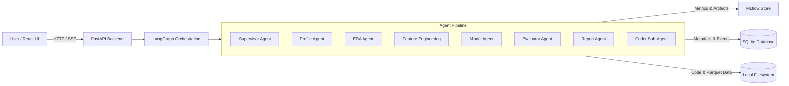

# Autonomous Tabular ML Engineering Platform

An autonomous, multi-agent machine learning platform that profiles tabular datasets, engineers features, trains scikit-learn models, evaluates performance in self-correcting loops, and generates technical reports using LangGraph and open-weight LLMs.

<!-- TODO: replace with a real screenshot or short GIF -->


## What This Is

This platform is an autonomous multi-agent system designed to execute complete tabular machine learning lifecycles without manual engineering intervention. A user provides a tabular dataset, selects a target variable, and specifies an optimization metric. Orchestrated via LangGraph, a coordinated team of specialized LLM agents profiles statistical properties, explores anomalies and relationships, generates reusable feature pipelines, trains and tunes scikit-learn models, critiques results through an evaluation loop, and compiles a comprehensive project report.

## Key Features

- **Multi-Agent LangGraph Workflow**: Specialized agents (Supervisor, Profile, EDA, Feature Engineering, Model, Evaluator, Report) execute in a strictly coordinated state graph.
- **Self-Correcting Evaluation Loop**: Dynamic Model ↔ Evaluator feedback loop critiques overfitting, residual patterns, and data leakage, triggering bounded iterative improvements.
- **Full Experiment Tracking**: Native MLflow integration logs parameters, metrics, pickled model artifacts, and predictions alongside SQLite metadata versioning.
- **Kaggle-Style Submission Engine**: Generates out-of-sample predictions and submission-ready CSV files directly from any checkpointed model.
- **Real-Time Agent Streaming**: Live Server-Sent Events (SSE) stream agent thoughts, decisions, code execution logs, and phase transitions to the web interface.
- **Local Open-Weight LLM Execution**: Runs fully locally on open-weight models via Ollama (`gpt-oss:120b`) without sending sensitive data to third-party APIs.

## Architecture



*The **Coder** sub-agent executes generated Python code inside isolated working directories via sandboxed `subprocess` calls with automated runtime debugging and retry loops.*

## Tech Stack

| Layer | Technology |
|---|---|
| **Agent Orchestration** | LangGraph, LangChain (`langchain-ollama`) |
| **LLM Inference** | Ollama (`gpt-oss:120b`) |
| **Backend API** | FastAPI, Uvicorn, Server-Sent Events (SSE) |
| **Machine Learning** | scikit-learn, pandas, numpy, pyarrow |
| **Experiment Tracking** | MLflow (SQLite store + local file artifacts) |
| **Database & ORM** | SQLite, SQLModel |
| **Frontend Application** | React 19, TypeScript, Vite, Tailwind CSS, TanStack Query |

## Getting Started

### 1. Prerequisites
- Python 3.11+
- Node.js 18+
- [Ollama](https://ollama.com/) running locally with the target model pulled:
  ```bash
  ollama pull gpt-oss:120b
  ```

### 2. Environment Configuration
Copy `.env.example` and set your Ollama parameters:
```bash
cp .env.example .env
```

### 3. Install Backend Dependencies
```bash
python -m venv .venv
source .venv/bin/activate  # On Windows: .venv\Scripts\activate
pip install -e .
```

### 4. Install Frontend Dependencies
```bash
cd frontend && npm install && cd ..
```

### 5. Run the Application
Start the required services in separate terminal windows:

```bash
# Terminal 1: MLflow Tracking Server
mlflow ui --backend-store-uri sqlite:///mlflow.db --port 5000

# Terminal 2: FastAPI Backend Server
uvicorn app.main:app --reload --port 8000

# Terminal 3: React Frontend Dev Server
cd frontend && npm run dev
```

Open [http://localhost:5173](http://localhost:5173) in your browser. Sample datasets (`housing.csv` and `titanic.csv`) are included in `sample_data/`.

## Project Structure

```text
├── app/               # FastAPI backend, agent graph, database schemas, and tool registry
│   ├── agents/        # Specialized LangGraph agent definitions
│   ├── api/           # API routes, run lifecycle coordinator, and SSE streaming
│   ├── core/          # Shared state models, memory managers, and model router
│   └── tools/         # Execution manager, MLflow logger, and dataset tools
├── docs/              # Master architecture and project specifications
├── frontend/          # React + Vite + TypeScript web interface
├── projects/          # Generated run directories, features, models, and reports
├── sample_data/       # Demo tabular datasets for quick testing
└── pyproject.toml     # Python dependencies and package metadata
```

## Scope & Intentional Boundaries

- **Tabular Data Only**: Specialized specifically for structured tabular data across binary classification, multiclass classification, and regression. Computer vision, NLP, and time-series forecasting are explicitly excluded.
- **scikit-learn Ecosystem**: Focuses on reproducible, interpretable classical machine learning algorithms rather than black-box deep learning architectures.
- **Zero Plots / Structured Artifacts**: EDA findings and model diagnostics produce structured JSON schemas and markdown tables rather than static charts, ensuring all agent outputs remain machine-readable and diffable.
- **Local-First & Single-Tenant**: Built for single-user local workstation workflows without authentication overhead or multi-tenant cloud infrastructure.

## License

This project is licensed under the [MIT License](LICENSE).
