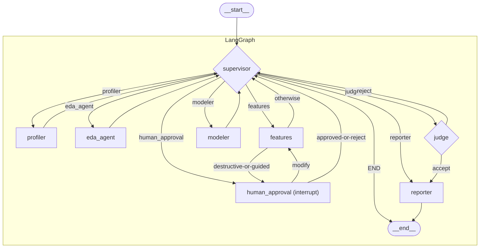

# ML_agent Architecture Map

**Version:** 2.0 — Phase 0 Recon (updated against agent-console.html contract)
**Date:** 2026-09-20

---

## 1. Entrypoints

| Component | Path | Status | Protocol | Responsibility |
|---|---|---|---|---|
| **CLI Runner** | main.py | **Active** | In-process sync | Accepts --dataset, --mode, --guided. Drives graph.stream(). On interrupt, prompts stdin for approved/modify/reject and resumes with Command(resume=...). |
| **FastAPI Bridge** | server/app.py | **Active** | HTTP REST + SSE | Mounts web/ at /. Starts runs, streams events, handles approval. Compiles and caches a singleton graph.py. |
| **Legacy WebSocket Server** | _extras/server.py | **Archived** | WebSocket | v1 chat-based server. Referenced _extras/frontend (deleted). Dead. |
| **Model Server** | _extras/model_server/ | **Auxiliary** | Shell / HTTP | Launches llama-server with local GGUF weights. Not used in server-mode runs. |
| **MCP Exec Server** | mcp_server/python_exec_server.py | **Active** | JSON-RPC 2.0 over stdio | Sandboxed Python subprocess for code generated by coder_agent. Spawned on-demand by tools/mcp_client.py. |

---

## 2. Graph Topology

Defined in graph.py, StateGraph(AgentState), compiled with MemorySaver checkpointer.

### Node Specification

| Node | File | State Keys Read | State Keys Written | Edges |
|---|---|---|---|---|
| **supervisor** | agents/supervisor.py:321 | iteration, profile, eda_findings, feature_set, candidate_models, last_verdict, retry_tier, retry_counts, metric_history, agent_fingerprints, last_executed_agent, mode | next_agent, requires_human_approval, approval_reason, stop_reason, retry_tier, task_instructions, supervisor_reasoning, agent_fingerprints, last_executed_agent | Conditional -> any node or END |
| **profiler** | agents/profiler_agent.py | dataset_path, target_column | profile, target_column, task_type | -> supervisor |
| **eda_agent** | agents/eda_agent.py | profile, target_column, task_type, dataset_path, dataset_fingerprint | eda_findings, run_memory (append), iteration | -> supervisor |
| **features** | agents/features_agent.py | profile, eda_findings, target_column, task_type, transformed_dataset_path, dataset_path, retry_tier, judge_feedback, guided_mode | feature_set, transformed_dataset_path, feature_plan, requires_human_approval, approval_reason, run_memory (append), iteration | Conditional -> human_approval or supervisor |
| **modeler** | agents/modeler_agent.py | profile, target_column, task_type, transformed_dataset_path, dataset_path, retry_tier, judge_feedback, candidate_models, best_metric, metric_history | candidate_models (append), metric_history (append), best_metric (replace), run_memory (append), iteration | -> supervisor |
| **judge** | agents/judge_agent.py | profile, feature_set, candidate_models, metric_history, best_metric, task_type, retry_counts, retry_tier, dataset_fingerprint | last_verdict, judge_feedback, retry_tier, retry_counts (increment), run_memory (append) | Conditional -> reporter or supervisor |
| **human_approval** | graph.py:27 | approval_reason, feature_plan, run_id, transformed_dataset_path | approval_status, requires_human_approval, transformed_dataset_path | Conditional -> features or supervisor |
| **reporter** | agents/reporter_agent.py | Full state + JSONL event log | report, artifact_path | -> END |
| **coder_agent (sub-agent)** | agents/coder_agent.py | Called sync by eda/features/modeler | Returns {success, code, stdout, output_path, attempts} | not a graph node |

---

## 3. Tier Logic

| Tier | Name | Meaning | May Try | Escalation Trigger |
|---|---|---|---|---|
| **Tier 0** | Internal HP tuning | Within a single model family; invisible to Supervisor | Grid/random CV search inside Coder script | Always exits naturally |
| **Tier 1** | Model family exploration | Features OK, model insufficient | Modeler: try different algorithm families | retry_counts[1] >= TIER1_RETRY_BUDGET (default 2) OR stall fingerprint OR sub-epsilon improvement |
| **Tier 2** | Feature re-engineering | Problem upstream of model | Features: re-engineer; then Modeler retries | retry_counts[2] >= TIER2_RETRY_BUDGET (default 2) OR identical feature state fingerprint |
| **Tier 3 (Human)** | Human escalation | All automated options exhausted | human_approval node, interrupt() | Budget cap, stall, iteration ceiling |

### Retry Mechanisms — exact file:line

| Mechanism | Location | Condition | Effect |
|---|---|---|---|
| Hard retry cap | supervisor.py:223-244 | retry_counts[tier] >= TIER{N}_RETRY_BUDGET | Override LLM to human_approval, approval_reason="retry_cap_exceeded" |
| Stall-retry escalation T1 | supervisor.py:252-297 | curr_fp == prev_fp OR abs(delta) < METRIC_IMPROVEMENT_EPSILON | Force human_approval, approval_reason="stalled" |
| Stall-retry escalation T2 | supervisor.py:300-313 | curr_fp == prev_fp (feature state) | Force human_approval, approval_reason="stalled" |
| Global iteration ceiling | supervisor.py:329-354 | iteration >= PIPELINE_GLOBAL_ITER_CEILING (default 200) | Short-circuit before LLM call; route to human_approval |
| Modeler plateau backstop | modeler_agent.py | No eps-improvement over CONVERGENCE_PATIENCE (default 3) iters | Stop internal loop, exit_reason="plateau" |
| Adaptive controller | adaptive_controller.py:256-349 | Safety envelope exhausted, error loop, plateau | wind_down -> reporter or escalate tier |
| Coder self-repair | coder_agent.py:168-202 | Execution failure | Feeds traceback back to LLM; max 4 attempts |

retry_counts is ONLY written by judge_agent (judge_agent.py:127-131). Supervisor reads but never writes it.

---

## 4. Existing API Surface

| Route | Method | Status | Response |
|---|---|---|---|
| /api/runs | POST | IMPLEMENTED | {run_id, status} |
| /api/runs | GET | IMPLEMENTED | [{run_id, status, stop_reason, dataset_path, mode, guided_mode, has_report, created_at, best_score?}] |
| /api/runs/{run_id} | GET | IMPLEMENTED | {run_id, status, stop_reason, best_score, total_attempts, total_tokens_in, total_tokens_out, total_cost_usd, duration_s, error_count, report, ...} |
| /api/runs/{run_id}/stream | GET SSE | IMPLEMENTED | SSE stream; supports Last-Event-ID / ?last_event_id= for replay |
| /api/runs/{run_id}/events/stream | GET SSE | ALIAS | Same as above |
| /api/runs/{run_id}/events | GET | IMPLEMENTED | Array of event payloads from SQLite |
| /api/runs/{run_id}/approve | POST | IMPLEMENTED | {status, approval_status} - resumes interrupt() via Command(resume=...) |
| /api/runs/{run_id}/control | POST | IMPLEMENTED | pause / resume / stop / escalate / retry_node |
| /api/runs/{run_id}/attempts | GET | IMPLEMENTED | Structured attempt ledger |
| /api/runs/{run_id}/errors | GET | IMPLEMENTED | Grouped error center by signature |
| /api/runs/{run_id}/export | GET | IMPLEMENTED | ZIP debug bundle |
| /api/runs/{run_id}/artifacts | GET | IMPLEMENTED | {report, models[], rag_entries[]} |
| /api/runs/{run_id}/events/{idx}/full_output | GET | IMPLEMENTED | Full untruncated stdout/stderr/code |
| /api/runs/compare | POST | IMPLEMENTED | Side-by-side run comparison |
| /api/datasets/upload | POST | IMPLEMENTED | {path, filename, size_bytes} |

GAP: The reference UI posts approval decisions to POST /api/runs/{run_id}/control with action:"resume" + approval_status. The server /control handler does NOT forward approval_status to the LangGraph Command(resume=...). Only /approve does. The new UI must call /approve for the interrupt gate.

---

## 5. Current SSE Event Payloads vs Phase 1 Contract

### What the backend emits today

| event/type | Source | Key fields present |
|---|---|---|
| node_start | server/app.py:236-242 (direct publish_to_subscribers) | run_id, node, agent, ts — NO intent, NO event_id, NOT PERSISTED |
| node_end | server/app.py:247-255 (direct publish_to_subscribers) | run_id, node, agent, ts, state_update — NO duration_ms, NO tokens/cost, NOT PERSISTED |
| supervisor_routed | supervisor.py:424 via log_event | next_agent, retry_tier, reasoning, task_instructions — WRONG EVENT TYPE NAME |
| attempt_result | coder_agent.py:187 via log_event | attempt, success, code, stdout, stderr, parent_agent — NO CV score, NO tier, NO decision |
| iteration_result | loop_utils.py:103 via log_event | iteration, metric, metric_name, metric_delta, is_improvement, is_stall — NO tier, NO duration_ms |
| verdict (judge) | judge_agent.py:113 via log_event | verdict, retry_tier, reasoning, feedback |
| approval_required | server/app.py:297 (direct publish_to_subscribers) | run_id, reason, stop_reason, feature_plan — NOT PERSISTED, NO event_id |
| run_complete | server/app.py:327 (direct publish_to_subscribers) | run_id, stop_reason, ts — NO final state_update, NOT PERSISTED |
| run_error | server/app.py:342 (direct publish_to_subscribers) | run_id, stop_reason, error, ts — NO traceback, NO error_signature, NOT PERSISTED |
| retry_cap_override | supervisor.py:224 via log_event | reason, llm_wanted, retry_counts, tier, count |
| stalled_retry_escalation | supervisor.py:274 via log_event | tier, metric_history_tail, fingerprint, reason |
| global_iteration_ceiling | supervisor.py:332 via log_event | iteration, ceiling |
| plateau_detected | adaptive_controller.py:314 via record_event | reason, decision |
| safety_envelope_exhausted | adaptive_controller.py:280 via record_event | reason, decision, next_agent |
| step_start/end/error | logger.py:146 | step, duration_sec |
| loop_decision | loop_utils.py:90 | iteration, decision, reasoning, task_spec |
| mcp_fallback | coder_agent.py:74 | error |

### Gap vs Phase 1 Contract

| Required | Status | Root cause |
|---|---|---|
| event_id on every event | PARTIAL | Server lifecycle events bypass record_event; no event_id, not persisted |
| supervisor_decision event type | MISSING | Supervisor emits supervisor_routed |
| node_start.intent | MISSING | Not populated in server/app.py:238 |
| node_end.duration_ms | MISSING | Not in server/app.py:247-255 |
| node_end.summary | MISSING | Not emitted |
| node_end.tokens_in/out/cost_usd/model_name | MISSING | Not tracked per node |
| attempt_result.score/tier/decision/reason/duration_ms | MISSING | Coder logs attempt but not the scored CV result |
| duplicate_idea_rejected event | MISSING | Registry exists but no event emitted on rejection |
| approval_required.approval_reason field | PARTIAL | Field present as "reason", not "approval_reason" |
| run_error.traceback/error_signature | MISSING | Only str(exc) |
| run_complete.state_update | MISSING | Only stop_reason |
| state_replace convention on all events | MISSING | Never emitted |
| higher_is_better on scored events | MISSING | Client must infer from metric name |
| code_diff on attempt_result | MISSING | No diff vs previous attempt |
| Persistence of server-emitted lifecycle events | MISSING | node_start/node_end/approval_required/terminal bypass record_event |

---

## 6. Boundary List (19 numbered boundaries for Phase 2 reference)

| # | Boundary | From | To | File:Line | Vulnerability |
|---|---|---|---|---|---|
| B1 | Profiler LLM parse | LLM string | Python dict | profiler_agent.py:147 | JSON fences, invalid JSON. Fixed with _parse_json(). |
| B2 | Profiler numeric stats | Pandas Series | Profile dict | profiler_agent.py:90 | mean()/std() on single-row -> NaN. Fixed with safe_round(). |
| B3 | EDA decision parse | LLM Output | Pydantic EdaStepDecision | eda_agent.py:91 | Casing mismatch. _flexible_construct fallback. |
| B4 | Features decision parse | LLM Output | Pydantic FeatureStepDecision | features_agent.py:117 | Incomplete structured output. Fallback. |
| B5 | Features structural diff | DataFrames | State dict | features_agent.py:170 | Empty DF -> None row counts. |
| B6 | Modeler decision parse | LLM Output | Pydantic ModelStepDecision | modeler_agent.py:146 | Schema mismatch -> fallback. |
| B7 | Coder script invocation | Code string | Subprocess / MCP | coder_agent.py:178 | NaN/inf/div-zero in generated code. |
| B8 | Modeler stdout parser | Raw stdout | Dict RESULT_JSON | modeler_agent.py:53 | Regex misses NaN-valued JSON lines. |
| B9 | CV score coercion + direction | String/dict | float + best_metric | modeler_agent.py:192 | float(None) -> ValueError. Fixed via to_float + is_better. |
| B10 | Judge verdict parse | LLM Output | Pydantic JudgeVerdict | judge_agent.py:96 | LLM failure -> hardcoded fallback accept. |
| B11 | Supervisor decision parse | LLM Output | Pydantic SupervisorDecision | supervisor.py:404 | None -> deterministic fallback. |
| B12 | Metric delta calculation | metric_history floats | float subtraction | supervisor.py:260 | None/NaN -> TypeError. Fixed via safe_diff(). |
| B13 | Loop result event emission | Iteration dict | log_event() | loop_utils.py:103 | Kwarg conflict agent= previously caused TypeError. Fixed. |
| B14 | Event JSONL persistence | Event dict | events.jsonl | tools/tracer.py:339 | NaN/numpy types -> bad JSON. Fixed via safe_json(). |
| B15 | Vector memory cosine | Text/vectors | float similarity | memory/run_memory.py:62 | Zero-norm vector -> divide by zero. |
| B16 | Reporter monitoring summary | JSONL lines | Markdown | reporter_agent.py:36 | None metric embedded as literal "None". |
| B17 | SSE event translation | Internal dict | SSE payload | server/app.py:176 | json.dumps(translated, default=str) converts NaN -> "nan" string, not null. |
| B18 | SSE transmission | JSON text | JSON.parse in browser | server/app.py:463 | Same default=str issue. Events from publish_to_subscribers skip safe_json. |
| B19 | Browser DOM rendering | JS object | DOM element | web/app.js | (m.cv_score || 0).toFixed(4) renders missing score as 0.0000; escapeHtml returns '' for false/0. |

---

## 7. UI Directory Status

| Directory | Status | Served by |
|---|---|---|
| **web/** | **ACTIVE** — mounted at / by server/app.py:836 | FastAPI StaticFiles |
| _extras/frontend | DELETED — was Vite/React for v1 WebSocket server | N/A |
| ui/ | DOES NOT EXIST at workspace root | N/A |

NOTE: The task brief refers to ui/index.html, ui/app.js, ui/styles.css. These files live under web/, not ui/. Phase 3 will replace web/ contents. Recommend keeping web/ as the directory name since that is what the server already mounts. This is a decision point for your approval.

---

## 8. Summary: What Already Works vs What Is Missing

### Already implemented
- Full JSONL + SQLite dual persistence via tools/tracer.record_event()
- event_id + seq on all events that go through record_event
- Last-Event-ID SSE header honoured; since_seq replay from SQLite implemented
- safe_json, to_float, is_better, safe_diff, safe_round, safe_div, require all in utils/safe.py
- Typed exception hierarchy in utils/exceptions.py (LLMParseError, CodeExecutionError, MetricUnavailableError, StateError)
- supervisor_reasoning, judge_feedback, stop_reason exist in AgentState and are written by nodes
- TriedIdeasRegistry, NoiseBandPlateauDetector, ErrorSignatureDeduplicator, SafetyEnvelope, AdaptiveStoppingPolicy all in agents/adaptive_controller.py
- POST /api/runs/{run_id}/control with pause/resume/stop/escalate/retry_node
- POST /api/runs/{run_id}/approve with Command(resume=...) wiring

### Missing for Phase 1 (items to fix, not design)
1. Server-emitted lifecycle events (node_start, node_end, approval_required, run_complete, run_error) bypass record_event — no event_id, not persisted, dropped on reconnect
2. supervisor_decision event type (currently supervisor_routed)
3. node_start.intent, node_end.duration_ms, node_end.summary, token/cost fields on node_end
4. Merged attempt_result (Coder result + CV score + tier + decision in one event)
5. duplicate_idea_rejected event when registry blocks a repeat
6. state_replace flag on all events
7. higher_is_better on all scored events
8. run_error.traceback + run_error.error_signature
9. run_complete.state_update (final accumulated state)
10. SSE serialisation using safe_json (currently default=str -> NaN becomes "nan" not null)
